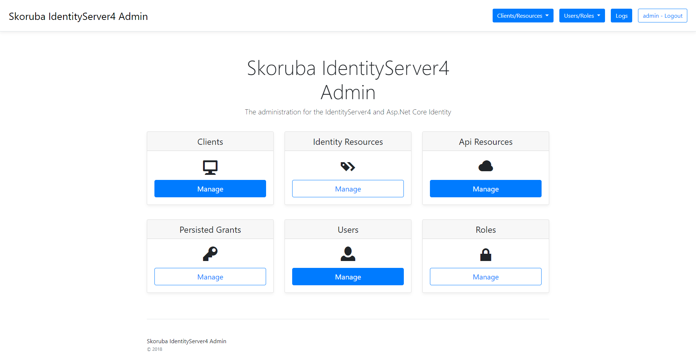
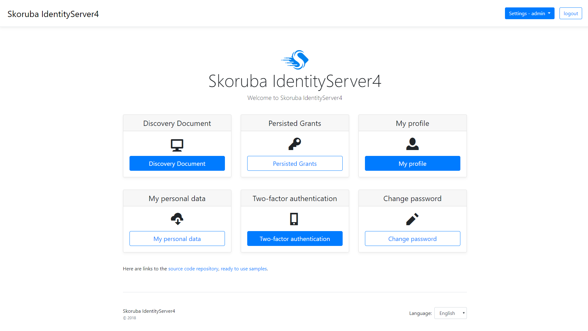
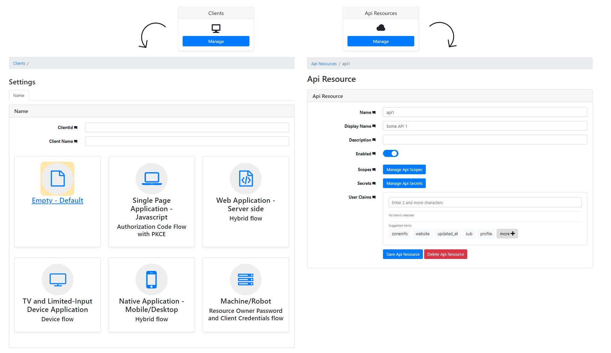
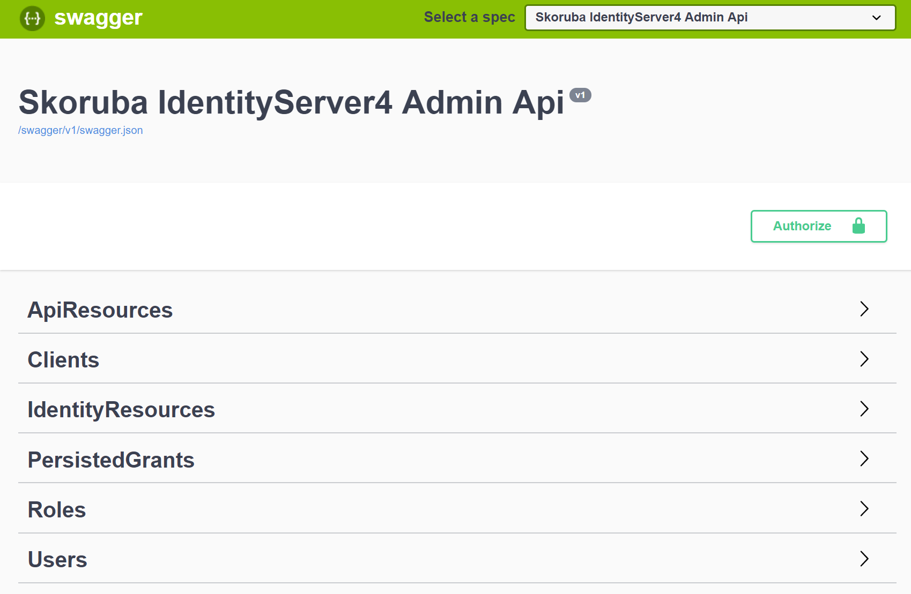
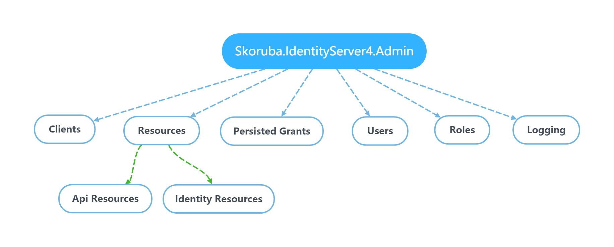
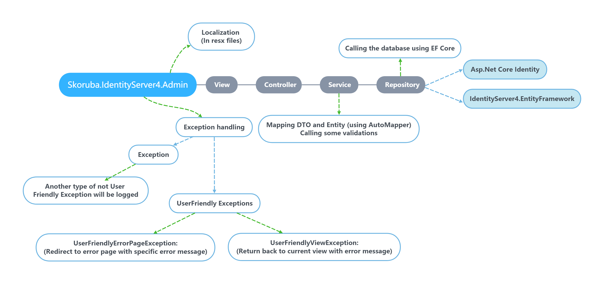

# Skoruba.IdentityServer4.Admin

> The administration of the IdentityServer4 and Asp.Net Core Identity

## Project Status

[](https://ci.appveyor.com/project/JanSkoruba/identityserver4-admin/branch/master)
[](https://dev.azure.com/skoruba/IdentityServer4.Admin/_build/latest?definitionId=2?branchName=master)
[](https://gitter.im/skoruba/IdentityServer4.Admin?utm_source=badge&utm_medium=badge&utm_campaign=pr-badge&utm_content=badge)

The application is written in the **Asp.Net Core MVC - using .NET Core 3.1**

**NOTE:** Works only with **IdentityServer4 version 3.0.0 and higher** 🚀

## Requirements

- [Install](https://www.microsoft.com/net/download/windows#/current) the latest .NET Core 3.x SDK (using older versions may lead to 502.5 errors when hosted on IIS or application exiting immediately after starting when self-hosted)

## Installation via dotnet new template

- Install the dotnet new template:

```sh
dotnet new -i Skoruba.IdentityServer4.Admin.Templates::1.0.0-rc1-update2
```

- Create new project:

```sh
dotnet new skoruba.is4admin --name MyProject --title MyProject --adminemail "admin@example.com" --adminpassword "Pa$$word123" --adminrole MyRole --adminclientid MyClientId --adminclientsecret MyClientSecret --dockersupport true
```

Project template options:

```
--name: [string value] for project name
--adminpassword: [string value] admin password
--adminemail: [string value] admin email
--title: [string value] for title and footer of the administration in UI
--adminrole: [string value] for name of admin role, that is used to authorize the administration
--adminclientid: [string value] for client name, that is used in the IdentityServer4 configuration for admin client
--adminclientsecret: [string value] for client secret, that is used in the IdentityServer4 configuration for admin client
--dockersupport: [boolean value] include docker support
```

## How to configure the Administration - IdentityServer4 and Asp.Net Core Identity

- [Follow these steps for setup project to use existing IdentityServer4 and Asp.Net Core Identity](docs/Configure-Administration.md)

### Template uses following list of nuget packages

- [Available nuget packages](https://www.nuget.org/profiles/skoruba)

### Running in Visual Studio

- Set Startup projects:
  - Skoruba.IdentityServer4.Admin
  - Skoruba.IdentityServer4.Admin.Api
  - Skoruba.IdentityServer4.STS.Identity

## Configuration of Administration for Deployment

- [Configuration of Admin for deploy on Azure](docs/Configure-Azure-Deploy.md)
- [Configuration of Admin on Ubuntu with PostgreSQL database](docs/Configure-Ubuntu-PostgreSQL-Tutorial.md)

## Administration UI preview

- This administration uses bootstrap 4

- Admin UI



- Security token service (STS)



- Forms:



## Cloning

```sh
git clone https://github.com/skoruba/IdentityServer4.Admin
```

## Running via Docker

- It is possible to run Admin UI through the docker.

- Project contains the `docker-compose.vs.debug.yml` and `docker-compose.override.yml` to enable debugging with a seeded environment. 
- The following possibility to get a running seeded and debug-able (in VS) environment:

```
docker-compose build
docker-compose up -d
```

> It is also possible to set as startup project the project called `docker-compose` in Visual Studio.

### Docker images
- Docker images will be available also in [docker hub](https://hub.docker.com/u/skoruba)
  - AdminUI:
    - `skoruba/identityserver4-admin:rc1`
  - Admin Api:
    - `skoruba/identityserver4-admin-api:rc1`
  - STS:
    - `skoruba/identityserver4-sts-identity:rc1`
    
### Publish Docker images to Docker hub
- Check the script in `build/publish-docker-images.ps1` - change the profile name according to your requirements.

## Installation of the Client Libraries

```sh
cd src/Skoruba.IdentityServer4.Admin
npm install

cd src/Skoruba.IdentityServer4.STS.Identity
npm install
```

## Bundling and Minification

The following Gulp commands are available:

- `gulp fonts` - copy fonts to the `dist` folder
- `gulp styles` - minify CSS, compile SASS to CSS
- `gulp scripts` - bundle and minify JS
- `gulp clean` - remove the `dist` folder
- `gulp build` - run the `styles` and `scripts` tasks

## EF Core & Data Access

- The solution uses these `DbContexts`:

  - `AdminIdentityDbContext`: for Asp.Net Core Identity
  - `AdminLogDbContext`: for logging
  - `IdentityServerConfigurationDbContext`: for IdentityServer configuration store
  - `IdentityServerPersistedGrantDbContext`: for IdentityServer operational store
  - `AuditLoggingDbContext`: for Audit Logging

### Run entity framework migrations:

> NOTE: Initial migrations are a part of the repository.

  - It is possible to use powershell script in folder `build/add-migrations.ps1`.
  - This script take two arguments:
    - --migration (migration name)
    - --migrationProviderName (provider type - available choices: All, SqlServer, MySql, PostgreSQL)

- For example: 
`.\add-migration.ps1 -migration DbInit -migrationProviderName SqlServer`

### Available database providers:
- SqlServer
- MySql
- PostgreSQL

> It is possible to switch the database provider via `appsettings.json`:
```
"DatabaseProviderConfiguration": {
        "ProviderType": "SqlServer" 
    }
```
        
### Connection strings samples for available db providers:
**PostgreSQL**: 
> Server=localhost;Port=5432;Database=IdentityServer4Admin;User Id=sa;Password=#;

**MySql:** 
> server=localhost;database=IdentityServer4Admin;user=root;password=#


### We suggest to use seed data:

- In `Program.cs` -> `Main`, uncomment `DbMigrationHelpers.EnsureSeedData(host)` or use dotnet CLI `dotnet run /seed`
- The `Clients` and `Resources` files in `identityserverdata.json` (section called: IdentityServerData) - are the initial data, based on a sample from IdentityServer4
- The `Users` file in `identitydata.json` (section called: IdentityData) contains the default admin username and password for the first login

## Authentication and Authorization

- Change the specific URLs and names for the IdentityServer and Authentication settings in `appsettings.json`
- In the controllers is used the policy which name is stored in - `AuthorizationConsts.AdministrationPolicy`. In the policy - `AuthorizationConsts.AdministrationPolicy` is defined required role stored in - `appsettings.json` - `AdministrationRole`.
- With the default configuration, it is necessary to configure and run instance of IdentityServer4. It is possible to use initial migration for creating the client as it mentioned above


## Logging

- We are using `Serilog` with pre-definded following Sinks - white are available in `serilog.json`:

  - Console
  - File
  - MSSqlServer
  
```json
{
    "Serilog": {
        "MinimumLevel": {
            "Default": "Error",
            "Override": {
                "Skoruba": "Information"
            }
        },
        "WriteTo": [
            {
                "Name": "Console"
            },
            {
                "Name": "File",
                "Args": {
                    "path": "log.txt",
                    "rollingInterval": "Day"
                }
            },
            {
                "Name": "MSSqlServer",
                "Args": {
                    "connectionString": "...",
                    "tableName": "Log",
                    "columnOptionsSection": {
                        "addStandardColumns": [ "LogEvent" ],
                        "removeStandardColumns": [ "Properties" ]
                    }
                }
            }
        ]
    }
}
```

## Audit Logging

- This solution uses audit logging via - https://github.com/skoruba/AuditLogging (check this link for more detal about this implementation :blush:)
- In the Admin UI project is following setup:

```cs
services.AddAuditLogging(options => { options.Source = auditLoggingConfiguration.Source; })
                .AddDefaultHttpEventData(subjectOptions =>
                    {
                        subjectOptions.SubjectIdentifierClaim = auditLoggingConfiguration.SubjectIdentifierClaim;
                        subjectOptions.SubjectNameClaim = auditLoggingConfiguration.SubjectNameClaim;
                    },
                    actionOptions =>
                    {
                        actionOptions.IncludeFormVariables = auditLoggingConfiguration.IncludeFormVariables;
                    })
                .AddAuditSinks<DatabaseAuditEventLoggerSink<TAuditLog>>();

            // repository for library
            services.AddTransient<IAuditLoggingRepository<TAuditLog>, AuditLoggingRepository<TAuditLoggingDbContext, TAuditLog>>();

            // repository and service for admin
            services.AddTransient<IAuditLogRepository<TAuditLog>, AuditLogRepository<TAuditLoggingDbContext, TAuditLog>>();
            services.AddTransient<IAuditLogService, AuditLogService<TAuditLog>>();
```

### Audit Logging Configuration

In `appsettings.json` is following configuration:

```json
"AuditLoggingConfiguration": {
    "Source": "IdentityServer.Admin.Web",
    "SubjectIdentifierClaim": "sub",
    "SubjectNameClaim": "name",
    "IncludeFormVariables": false
  }
```

The `Skoruba.IdentityServer4.Admin.BusinessLogic` layer contains folder called `Events` for audit logging. In each method in Services is called function `LogEventAsync` like this:

```
await AuditEventLogger.LogEventAsync(new ClientDeletedEvent(client));
```
Final audit log is available in the table `dbo.AuditLog`.

### Login Configuration

- In `Skoruba.IdentityServer4.STS.Identity` - in `appsettings.json` is possible to specify which column will be used for login (`Username` or `Email`):

```
  "LoginConfiguration": {
    "ResolutionPolicy": "Username"
  }
```

or using `Email`:

```
  "LoginConfiguration": {
    "ResolutionPolicy": "Email"
  }
```

### Register Configuration

- In `Skoruba.IdentityServer4.STS.Identity` - in `appsettings.json` is possible to disable user registration (`default: true`):

```
 "RegisterConfiguration": {
    "Enabled": false
  }
```

## How to configure API & Swagger

- For development is running on url - `http://localhost:5001` and swagger UI is available on url - `http://localhost:5001/swagger`
- For swagger UI is configured a client and an API in STS:

```
"AdminApiConfiguration": {
  "IdentityServerBaseUrl": "http://localhost:5000",
  "OidcSwaggerUIClientId": "skoruba_identity_admin_api_swaggerui",
  "OidcApiName": "skoruba_identity_admin_api"
}
```

- Swagger UI contains following endpoints:




## How to configure an external provider in STS

- In `Skoruba.IdentityServer4.STS.Identity/Helpers/StartupHelpers.cs` - is method called `AddExternalProviders` which contains the example with `GitHub` and in `appsettings.json`:

```
"ExternalProvidersConfiguration": {
        "UseGitHubProvider": false,
        "GitHubClientId": "",
        "GitHubClientSecret": ""
}
```

- It is possible to extend `ExternalProvidersConfiguration` with another configuration properties.

### List of external providers for ASP.NET Core:
  - https://github.com/aspnet-contrib/AspNet.Security.OAuth.Providers
  - https://docs.microsoft.com/en-us/aspnet/core/security/authentication/social/
 
### Azure AD
- Great article how to set up Azure AD:
  - https://azure.microsoft.com/cs-cz/resources/samples/active-directory-dotnet-webapp-openidconnect-aspnetcore/

## Email service

- It is possible to set up emails via:

### SendGrid

In STS project - in `appsettings.json`:
```
"SendgridConfiguration": {
        "ApiKey": "",
        "SourceEmail": "",
        "SourceName": ""
    }
```

### SMTP

```
"SmtpConfiguration": {
        "Host": "",
        "Login": "",
        "Password": ""
    }
```

## Health checks

- AdminUI, AdminUI Api and STS contain endpoint `health`, which check databases and IdentityServer.


## Localizations - labels, messages

- The project has following translations:
  - English
  - Chinese
  - Russian
  - Persian
  - Swedish
  - Danish
  - Spanish
  - French
  - Finish
  
#### Feel free to send a PR with your translation. :blush:

- All labels and messages are stored in the resources `.resx` - locatated in `/Resources`

  - Client label descriptions from - http://docs.identityserver.io/en/latest/reference/client.html
  - Api Resource label descriptions from - http://docs.identityserver.io/en/latest/reference/api_resource.html
  - Identity Resource label descriptions from - http://docs.identityserver.io/en/latest/reference/identity_resource.html

## Tests

- The solution contains unit and integration tests.

Integration tests use StartupTest class which is pre-configured with:
  - `DbContext` contains setup for InMemory database
  - `Authentication` is setup for `CookieAuthentication` - with fake login url for testing purpose only
  - `AuthenticatedTestRequestMiddleware` - middleware for testing of authentication.

## Overview

### Solution structure:

- STS:

  - `Skoruba.IdentityServer4.STS.Identity` - project that contains the instance of IdentityServer4 and combine these samples - [Quickstart UI for the IdentityServer4 with Asp.Net Core Identity and EF Core storage](https://github.com/IdentityServer/IdentityServer4/tree/master/samples/Quickstarts/9_Combined_AspId_and_EFStorage) and [damienbod - IdentityServer4 and Identity template](https://github.com/damienbod/IdentityServer4AspNetCoreIdentityTemplate)

- Admin UI Api:

  - `Skoruba.IdentityServer4.Admin.Api` - project with Api for managing data of IdentityServer4 and Asp.Net Core Identity, with swagger support as well

- Admin UI:

  - `Skoruba.IdentityServer4.Admin` - ASP.NET Core MVC application that contains Admin UI

  - `Skoruba.IdentityServer4.Admin.BusinessLogic` - project that contains Dtos, Repositories, Services and Mappers for the IdentityServer4

  - `Skoruba.IdentityServer4.Admin.BusinessLogic.Identity` - project that contains Dtos, Repositories, Services and Mappers for the Asp.Net Core Identity

  - `Skoruba.IdentityServer4.Admin.BusinessLogic.Shared` - project that contains shared Dtos and ExceptionHandling for the Business Logic layer of the IdentityServer4 and Asp.Net Core Identity

  - `Skoruba.IdentityServer4.Admin.EntityFramework` - EF Core data layer that contains Entities for the IdentityServer4

  - `Skoruba.IdentityServer4.Admin.EntityFramework.Identity` - EF Core data layer that contains Repositories for the Asp.Net Core Identity
  
  - `Skoruba.IdentityServer4.Admin.EntityFramework.Extensions` - project that contains extensions related to EntityFramework

  - `Skoruba.IdentityServer4.Admin.EntityFramework.Shared` - project that contains DbContexts for the IdentityServer4, Logging and Asp.Net Core Identity, inluding shared Identity entities

  - `Skoruba.IdentityServer4.Admin.EntityFramework.SqlServer` - project that contains migrations for SqlServer

  - `Skoruba.IdentityServer4.Admin.EntityFramework.MySql` - project that contains migrations for MySql

  - `Skoruba.IdentityServer4.Admin.EntityFramework.PostgreSQL` - project that contains migrations for PostgreSQL


- Tests:

  - `Skoruba.IdentityServer4.Admin.IntegrationTests` - xUnit project that contains the integration tests for AdminUI
  
  - `Skoruba.IdentityServer4.Admin.Api.IntegrationTests` - xUnit project that contains the integration tests for AdminUI Api

  - `Skoruba.IdentityServer4.Admin.UnitTests` - xUnit project that contains the unit tests for AdminUI

  - `Skoruba.IdentityServer4.STS.IntegrationTests` - xUnit project that contains the integration tests for STS

### The admininistration contains the following sections:



## IdentityServer4

**Clients**

It is possible to define the configuration according the client type - by default the client types are used:

- Empty
- Web Application - Server side - Hybrid flow
- Single Page Application - Javascript - Authorization Code Flow with PKCE
- Native Application - Mobile/Desktop - Hybrid flow
- Machine/Robot - Resource Owner Password and Client Credentials flow
- TV and Limited-Input Device Application - Device flow

- Actions: Add, Update, Clone, Remove
- Entities:
  - Client Cors Origins
  - Client Grant Types
  - Client IdP Restrictions
  - Client Post Logout Redirect Uris
  - Client Properties
  - Client Redirect Uris
  - Client Scopes
  - Client Secrets

**API Resources**

- Actions: Add, Update, Remove
- Entities:
  - Api Claims
  - Api Scopes
  - Api Scope Claims
  - Api Secrets
  - Api Properties

**Identity Resources**

- Actions: Add, Update, Remove
- Entities:
  - Identity Claims
  - Identity Properties

## Asp.Net Core Identity

**Users**

- Actions: Add, Update, Delete
- Entities:
  - User Roles
  - User Logins
  - User Claims

**Roles**

- Actions: Add, Update, Delete
- Entities:
  - Role Claims

## Application Diagram



## Roadmap & Vision

### 1.0.0:

- [x] Create the Business Logic & EF layers - available as a nuget package
- [x] Create a project template using dotnet CLI - `dotnet new template`
  - [x] First template: The administration of the IdentityServer4 and Asp.Net Core Identity
- [x] Add logging into
  - [x] Database
  - [x] File
- [x] Add localization for other languages
  - [x] English
  - [x] Chinese
  - [x] Russian
  - [x] Persian
  - [x] Swedish
  - [x] Danish
  - [x] Spanish
  - [x] French
  - [x] Finish
- [x] Manage profile
- [x] Password reset
- [x] Link account to an external provider (example with Github)
- [x] Two-Factor Authentication (2FA)
- [x] User registration
- [x] Email service
  - [x] SendGrid
- [x] Add API
  - [x] IdentityServer4
  - [x] Asp.Net Core Identity
  - [x] Add swagger support
- [x] Add audit logs to track changes ([#61](https://github.com/skoruba/IdentityServer4.Admin/issues/61))
- [x] Docker support ([#121](https://github.com/skoruba/IdentityServer4.Admin/issues/121))
- [x] Health Checks (Databases and IdentityServer)
- [x] Support for multiple database providers (SqlServer, Mysql, PostgreSQL)

### 2.0.0:

- [ ] Create a project template using dotnet CLI - `dotnet new template`
  - [ ] Second template: The administration of the IdentityServer4 (without Asp.Net Core Identity) ([#79](https://github.com/skoruba/IdentityServer4.Admin/issues/79))

### Future:

- Add UI tests ([#97](https://github.com/skoruba/IdentityServer4.Admin/issues/97), [#116](https://github.com/skoruba/IdentityServer4.Admin/issues/116))
- Add more unit and integration tests :blush:
- Extend administration for another protocols
- Create separate UI using `Razor Class Library` ([#28](https://github.com/skoruba/IdentityServer4.Admin/issues/28), [#133](https://github.com/skoruba/IdentityServer4.Admin/issues/133))

## Licence

This repository is licensed under the terms of the [**MIT license**](LICENSE.md).

**NOTE**: This repository uses the source code from https://github.com/IdentityServer/IdentityServer4.Quickstart.UI which is under the terms of the
[**Apache License 2.0**](https://github.com/IdentityServer/IdentityServer4.Quickstart.UI/blob/master/LICENSE).

## Acknowledgements

This web application is based on these projects:

- ASP.NET Core
- IdentityServer4.EntityFramework
- ASP.NET Core Identity
- XUnit
- Fluent Assertions
- Bogus
- AutoMapper
- Serilog

Thanks to [Tomáš Hübelbauer](https://github.com/TomasHubelbauer) for the initial code review.

Thanks to [Dominick Baier](https://github.com/leastprivilege) and [Brock Allen](https://github.com/brockallen) - the creators of IdentityServer4.

## Contributors

Thanks goes to these wonderful people ([emoji key](https://github.com/kentcdodds/all-contributors#emoji-key)):

<!-- prettier-ignore-start -->
| [<br /><sub> Jan Škoruba</sub>](https://github.com/skoruba) <br /> 💻 💬 📖 💡 🤔 | [<br /><sub> Tomáš Hübelbauer</sub>](https://github.com/TomasHubelbauer) <br /> 💻 👀 📖  🤔 | [<br /><sub>Michał Drzał </sub>](https://github.com/xmichaelx) <br />💻 👀 📖 💡 🤔 | [<br /><sub>cerginio </sub>](https://github.com/cerginio) <br /> 💻 🐛 💡 🤔 | [<br /><sub>Sven Dummis </sub>](https://github.com/svendu) <br /> 📖| [<br /><sub>Seaear</sub>](https://github.com/Seaear) <br />💻 🌍|
| :---: | :---: | :---: | :---: | :---: | :---: |
|[<br /><sub>Rune Antonsen </sub>](https://github.com/ruant) <br />🐛|[<br /><sub>Sindre Njøsen </sub>](https://github.com/Sindrenj) <br />💻|[<br /><sub>Alevtina Brown </sub>](https://github.com/alev7ina) <br />🌍|[<br /><sub>Brice </sub>](https://github.com/Brice-xCIT) <br />💻|[<br /><sub>TheEvilPenguin </sub>](https://github.com/TheEvilPenguin) <br />💻|[<br /><sub>Saeed Rahmani </sub>](https://github.com/saeedrahmo) <br />🌍|
|[<br /><sub>Andy Yu </sub>](https://github.com/Zyxious) <br />🌍|[<br /><sub>ChrisSzabo </sub>](https://github.com/ChrisSzabo) <br />💻|[<br /><sub>aiscrim </sub>](https://github.com/aiscrim) <br />💻 💡 🤔|[<br /><sub>HrDahl </sub>](https://github.com/HrDahl) <br />🌍|[<br /><sub>Andrew Godfroy </sub>](https://github.com/killerrin) <br />📖|[<br /><sub>bravecobra </sub>](https://github.com/bravecobra) <br />💻|
|[<br /><sub>Sabit Igde </sub>](https://github.com/sabitertan) <br />💻|[<br /><sub>Rico Herlt </sub>](https://github.com/rherlt) <br />💻|[<br /><sub>b0 </sub>](https://github.com/b0) <br />💻|[<br /><sub>DrQwertySilence </sub>](https://github.com/DrQwertySilence) <br />🌍|[<br /><sub>Carl Quirion </sub>](https://github.com/nlz242) <br />💻|[<br /><sub>Aegide </sub>](https://github.com/Aegide) <br />🌍|
|[<br /><sub>LobsterBandit </sub>](https://github.com/LobsterBandit) <br />💻|[<br /><sub>Mehmet Perk </sub>](https://github.com/mperk) <br />💻|[<br /><sub>tapmui </sub>](https://github.com/tapmui) <br />🌍|[<br /><sub>Saeed Rahimi </sub>](https://github.com/saeedrahimi) <br />💻
<!-- prettier-ignore-end -->

This project follows the [all-contributors](https://github.com/kentcdodds/all-contributors) specification.
Contributions of any kind are welcome!

## Contact and Suggestion

I am happy to share my attempt of the implementation of the administration for IdentityServer4 and ASP.NET Core Identity.

Any feedback is welcome - feel free to create an issue or send me an email - [jan@skoruba.com](mailto:jan@skoruba.com). Thank you :blush:

## Support and Donation 🕊️

If you like my work, you can support me by donation. 👍 

https://www.paypal.me/skoruba
